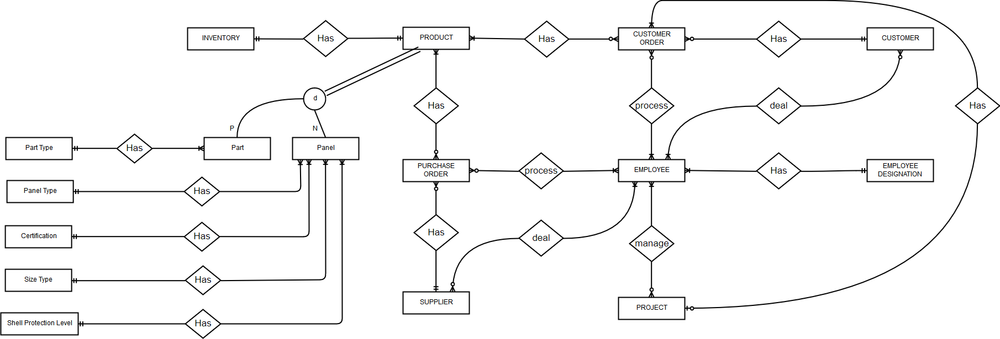
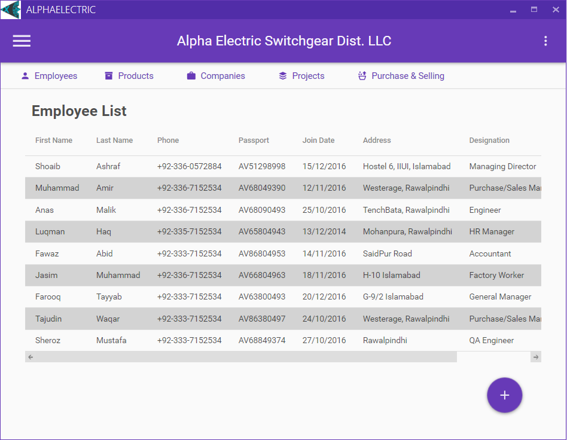
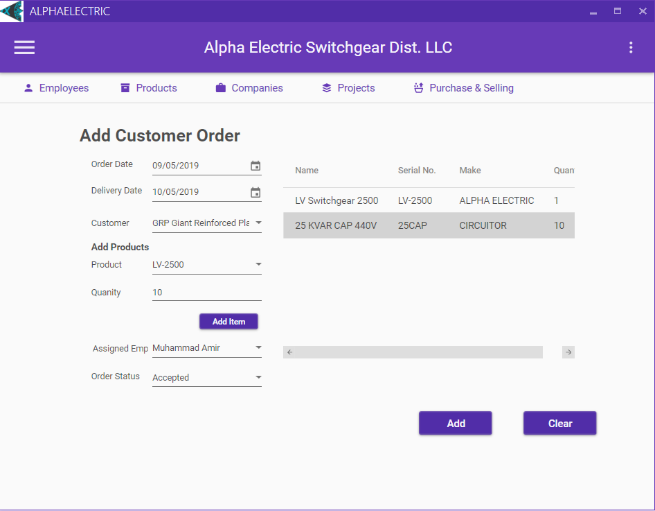
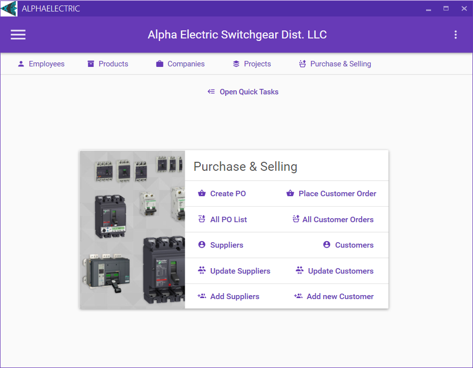

# Alpha Electric System

A company management system in C# WPF and Material Design.

## Description

The project is about a fictional electric company named Alpha Electric Switch Gear Company. The company designs, manufactures and assembles Main Distribution Board (MDB), Sub Main Distribution Boards (SMDB), LV Panels (ACB panels), Capacitor Banks, other standard panels. It receives and sells products and projects with other companies and also provide the service of repair and maintenance.

It uses Material Design for front-end and for backend 2-Tier Architecture (Factory classes and separate data access layer approach)

## ERD

## Screenshots

## Features

*	Product Management
*	Project Management
*	Inventory Management
*	Employee Management
*	Customer Management
*	Supplier Management
*	Purchase Order Management
*	Customer Order Management
*	Login System

## Getting Started

### Dependencies

* Windows 
* .NET Framework 4.6.2
* SQL Server
* ADO.NET
* Material Design XAML Toolkit 

### Installing

* Create a database 'AlphaElectric' in SQL Server
* Execute the SQL Script. It has the complete demo data as well. 
* Edit the connection string in both of the projects. 
* Compile the program, defaut username is 'shuayb' and password is '12345'.

## Author

[@Shuayb Ashraf](https://twitter.com/shuayb_ashraf)

## Version History

* 0.1
    * Initial Release

## License

This project is licensed under the GNU General Public License v3.0 - see the LICENSE.md file for details

## Acknowledgments

* [MaterialDesignInXamlToolkit](https://github.com/MaterialDesignInXAML/MaterialDesignInXamlToolkit)
